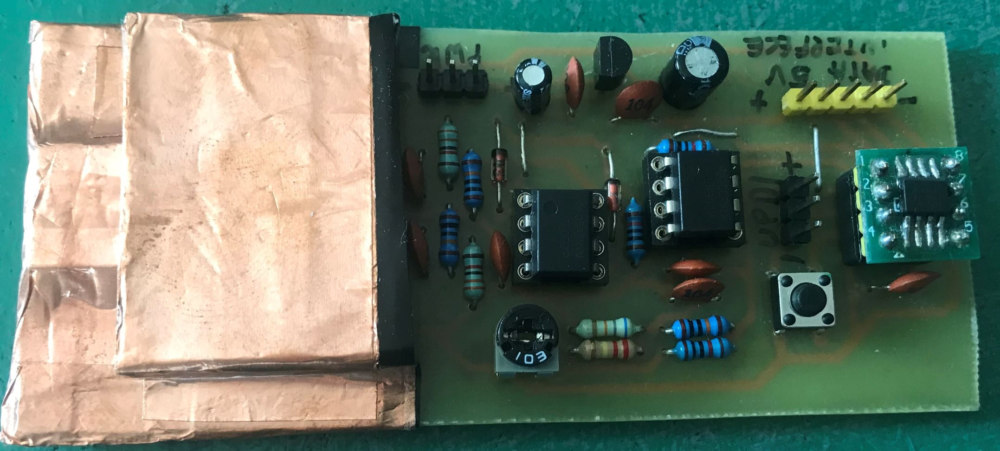
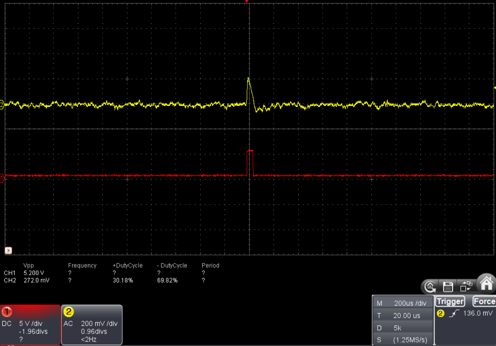

# Gamma Ray Detector

## Basic informations
Solid State gamma Ray detector based around PiN Diodeds (BPW34) as detection element and discreate transistor (BC549) as signal preamplifire (based on design published in Elektor magazine 06 - 2011). To increse detection rate of radiation while keeping good sensytivity espesialy for lower energy particles, device uses spit head approch - detection diodes are wired intu multiple detection heads (preamplifires) from witch output signal is then integrated and digitalized using compartor(LM393).

## Specs:
- Input voltage: 9V
- Data Procesing MCU: Attiny402 or pin compatible (so8 to dip8 adapter is nesesery in current board revision) 
## Theory of operation
TBA
## Digital signal procesing
Digital procesing is based on Attine402. Depending on the selected configuration data could be accese by a user e.g. through a COM port connection or an attached alfanumeric display. this solution supports counting all radioation events since device power up or counter reset (push button on the board) as well as a estimeted CPM (counts per minute). MCU firmware coming soon.
## Comparator circut calibration
To asure proper operation of detector's digital side nessesery is proper seting of reference voltage for comparator the easiest way to do this is:
- connect osciloscope to non inverting input of comparator (pin 3 on IC3) and to output of the same comparator (pin 1 on IC3)
- put the detector in area with minimal radiation (in most cases it is enought not to be in close procimty to ane designated sorce)
- dial the potenciometer (R19) until optput of a Comparator (IC3) stays low - set refernece voltage above a noice floor of a system
## Detection resoults 

